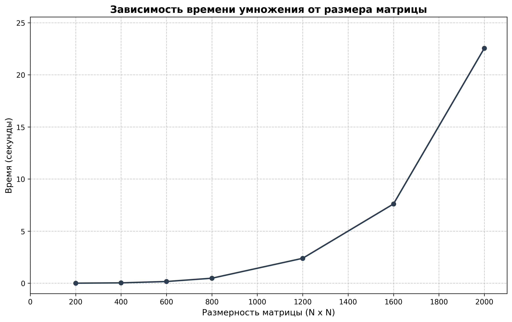

# Лабораторная работа №1: Исследование базового алгоритма перемножения матриц

**Студент:** Голосов Никита Вадимович  
**Группа:** 6311  
**Зачетная книжка:** 2023-00693  

## 1. Введение
Целью данной работы является реализация стандартного последовательного алгоритма умножения квадратных матриц на языке C++ и экспериментальный анализ его производительности. Полученные данные станут эталоном (baseline) для оценки эффективности параллельных алгоритмов в последующих работах.

## 2. Краткие теоретические сведения
Операция матричного умножения $C = A \times B$ для квадратных матриц размерности $N \times N$ определяется как:
$$C_{ij} = \sum_{k=0}^{N-1} A_{ik} \cdot B_{kj}$$

Теоретическая временная сложность данного алгоритма — **$O(N^3)$**. Это означает, что при увеличении размерности в 2 раза, количество вычислительных операций (умножений и сложений) возрастает в 8 раз. Суммарное количество операций оценивается величиной $2N^3$.

## 3. Описание реализации
В программе применены следующие технические решения:
*   **Управление памятью:** Использование одномерных векторов `std::vector<double>` вместо вложенных структур.
*   **Точность:** Использование типа `double` для обеспечения достаточной точности при работе с дробными числами.
*   **Замеры:** Использование библиотеки `<chrono>` для фиксации чистого времени работы вычислительного ядра.
*   **Оптимизация:** Компиляция кода проводилась с флагом `-O3` для оптимизации компилятора.

## 4. Состав проекта
*   `gen.py` — генератор входных матриц в текстовом формате.
*   `main.cpp` — исходный код последовательной программы на C++.
*   `check.py` — скрипт проверки корректности (сравнение результата C++ с библиотекой NumPy).
*   `plot_graph.py` — инструмент для визуализации результатов измерений.

## 5. Протокол испытаний
Для подтверждения правильности работы алгоритма проводилась верификация на Python. Во всех тестах результат перемножения на C++ совпал с эталонным значением NumPy с погрешностью не более $10^{-7}$.

### Сводная таблица производительности
| Размер матрицы (N) | Время выполнения (сек) | Вычислительная сложность ($2N^3$) |
| :--- | :---: | :---: |
| 200 | 0.003459 | $1.6 \times 10^7$ |
| 400 | 0.033989 | $1.28 \times 10^8$ |
| 600 | 0.162476 | $4.32 \times 10^8$ |
| 800 | 0.478172 | $1.02 \times 10^9$ |
| 1200 | 2.389910 | $3.45 \times 10^9$ |
| 1600 | 7.608410 | $8.19 \times 10^9$ |
| 2000 | 22.550700 | $1.60 \times 10^{10}$ |

## 6. График зависимости времени от размерности

## 7. Анализ результатов и выводы
В ходе работы был успешно реализован классический алгоритм матричного умножения. На основании полученных данных можно сделать следующие выводы:

1.  **Характер роста:** Экспериментально подтвержден кубический рост времени выполнения. График наглядно демонстрирует нелинейное ускорение роста времени при увеличении $N$.
2.  **Влияние памяти:** При достижении размерности $N=2000$ время выполнения начинает расти быстрее, чем предсказывает чистая математическая модель $O(N^3)$, что связано с увеличением частоты промахов кэша (cache misses) и ростом нагрузки на оперативную память.
3.  **Эффективность компиляции:** Использование флага `-O3` является обязательным условием для подобных задач, так как позволяет компилятору оптимизировать доступ к индексам массивов и разворачивать циклы.

Проделанная работа подтверждает корректность базового кода и создает основу для внедрения технологий OpenMP и MPI.
