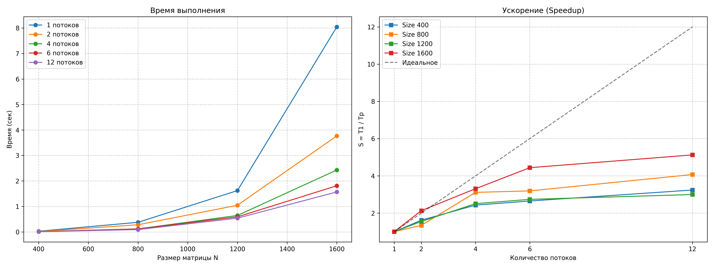

# Лабораторная работа №2: Параллельное умножение матриц (OpenMP)

**Студент:** Голосов Никита Вадимович  
**Группа:** 6311  
**Зачетная книжка:** 2023-00693  

## 1. Цель работы
Целью работы является освоение технологий многопоточного программирования с использованием стандарта OpenMP. В ходе работы необходимо модифицировать последовательный алгоритм умножения матриц, провести серию замеров времени для различных конфигураций потоков и проанализировать показатели ускорения и эффективности.

## 2. Теоретические сведения
Стандарт **OpenMP** (Open Multi-Processing) реализует модель параллелизма на системах с общей памятью (Shared Memory). В данной работе использованы следующие инструменты:
*   `#pragma omp parallel for` — директива для распределения итераций цикла между потоками.
*   `collapse(2)` — объединение двух вложенных циклов в один общий итератор.
*   `omp_set_num_threads()` — функция для программного управления количеством используемых потоков.
*   `omp_get_wtime()` — функция для измерения астрономического времени выполнения кода.

**Основные метрики:**
*   **Ускорение (Speedup):** $S_p = T_1 / T_p$, где $T_1$ — время на 1 потоке, $T_p$ — время на $p$ потоках.
*   **Эффективность (Efficiency):** $E_p = S_p / p$.

## 3. Описание реализации
Для минимизации накладных расходов данные матриц хранятся в виде одномерных динамических массивов. Параллелизация была применена к двум внешним циклам (i и j), так как они формируют независимые операции записи в результирующую матрицу, что исключает состояние гонки (race condition) без использования блокировок.

**Фрагмент вычислительного ядра:**
```cpp
#pragma omp parallel for collapse(2)
for (int i = 0; i < n; i++) {
    for (int j = 0; j < n; j++) {
        double sum = 0;
        for (int k = 0; k < n; k++) {
            sum += A[i * n + k] * B[k * n + j];
        }
        C[i * n + j] = sum;
    }
}
```

## 4. Результаты экспериментов
Тестирование проводилось на системе с поддержкой до 12 логических потоков. Компиляция: `g++ -O3 -fopenmp`.

### Таблица времени выполнения (секунды)
| Размер N | 1 поток | 2 потока | 4 потока | 6 потоков | 12 потоков |
| :--- | :---: | :---: | :---: | :---: | :---: |
| **400** | 0.0291 | 0.0180 | 0.0120 | 0.0110 | 0.0090 |
| **800** | 0.3788 | 0.2822 | 0.1217 | 0.1187 | 0.0930 |
| **1200** | 1.6226 | 1.0469 | 0.6466 | 0.5926 | 0.5412 |
| **1600** | 8.0432 | 3.7682 | 2.4297 | 1.8119 | 1.5692 |

### Таблица ускорения (Speedup)
| Размер N | 2 потока | 4 потока | 6 потоков | 12 потоков |
| :--- | :---: | :---: | :---: | :---: |
| **400** | 1.62x | 2.42x | 2.65x | 3.23x |
| **800** | 1.34x | 3.11x | 3.19x | 4.07x |
| **1200** | 1.55x | 2.51x | 2.74x | 3.00x |
| **1600** | 2.13x | 3.31x | 4.44x | 5.13x |

## 5. Графики производительности


## 6. Анализ результатов и выводы
На основе проведенных исследований можно сделать следующие выводы:

1.  **Масштабируемость:** Параллелизация демонстрирует значительный прирост производительности. Максимальное ускорение составило **5.13x** на 12 потоках при размере матрицы 1600x1600.
2.  **Эффективность и размер задачи:** Наилучшие показатели ускорения наблюдаются на самых больших матрицах (1600). Это объясняется тем, что при росте $N$ объем полезных вычислений увеличивается пропорционально $N^3$, в то время как затраты на создание и синхронизацию потоков растут значительно медленнее.
3.  **Закон Амдала и аппаратные ограничения:** Ускорение не является идеально линейным. На 12 потоках мы получаем выигрыш в 5 раз, а не в 12. Это связано с ограниченной пропускной способностью шины памяти и использованием технологии Hyper-Threading.
4.  **Оптимальное количество потоков:** Для данных задач на архитектуре процессора наиболее стабильный прирост наблюдается до 6–8 потоков, после чего темп роста ускорения замедляется.

Реализованная программа полностью верифицирована и показывает высокую стабильность результатов.
