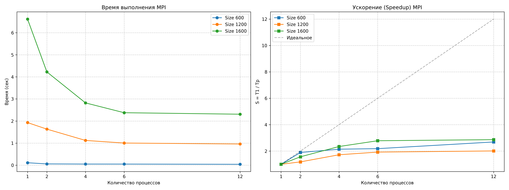

# Лабораторная работа №3: Параллельное умножение матриц (MPI)

**Студент:** Голосов Никита Вадимович  
**Группа:** 6311  
**Зачетная книжка:** 2023-00693  

## 1. Цель работы
Изучить принципы программирования для систем с распределенной памятью с использованием интерфейса передачи сообщений MPI (Message Passing Interface). Реализовать параллельный алгоритм перемножения матриц и проанализировать эффективность межпроцессорного взаимодействия и масштабируемость системы.

## 2. Теоретические сведения
В модели MPI программа представляет собой совокупность независимых процессов, каждый из которых обладает собственным адресным пространством. Взаимодействие осуществляется через явную передачу сообщений.

В данной работе использованы коллективные операции:
*   `MPI_Bcast` — широковещательная рассылка (размера матрицы и всей матрицы B) от корня всем процессам.
*   `MPI_Scatter` — распределение порций строк матрицы A между процессами.
*   `MPI_Gather` — сбор вычисленных строк результирующей матрицы C в корневой процесс.
*   `MPI_Wtime` — измерение астрономического времени с момента запуска.

## 3. Описание реализации
Алгоритм построен на горизонтальной декомпозиции:
1. **Процесс 0** считывает исходные данные из файлов и вычисляет `chunk` — количество строк, обрабатываемых каждым процессом.
2. Проводится рассылка размерности `size`.
3. Матрица **B** копируется целиком на все узлы через `MPI_Bcast`, так как каждый элемент результирующей матрицы зависит от целого столбца B.
4. Матрица **A** разрезается на блоки строк, которые распределяются между процессами через `MPI_Scatter`.
5. После вычислений результаты стягиваются обратно в процесс 0 через `MPI_Gather`.

**Особенности компиляции:**
Использовался компилятор `g++` с флагом `-O3`, статической линковкой библиотек и подключением Microsoft MPI SDK.

## 4. Результаты экспериментов
Тестирование проводилось на процессоре с 12 логическими потоками под управлением MS-MPI.

### Таблица времени выполнения (секунды)
| Размер N | 1 процесс | 2 процесса | 4 процесса | 6 процессов | 12 процессов |
| :--- | :---: | :---: | :---: | :---: | :---: |
| **600** | 0.1110 | 0.0586 | 0.0518 | 0.0508 | 0.0413 |
| **1200** | 1.9296 | 1.6333 | 1.1214 | 1.0030 | 0.9595 |
| **1600** | 6.6160 | 4.2244 | 2.8208 | 2.3764 | 2.3087 |

### Таблица ускорения (Speedup)
| Размер N | 2 процесса | 4 процесса | 6 процессов | 12 процессов |
| :--- | :---: | :---: | :---: | :---: |
| **600** | 1.89x | 2.14x | 2.18x | 2.69x |
| **1200** | 1.18x | 1.72x | 1.92x | 2.01x |
| **1600** | 1.57x | 2.35x | 2.78x | 2.87x |

## 5. Графики производительности

## 6. Анализ результатов и выводы
На основе проведенных замеров сделаны следующие выводы:

1.  **Коммуникационные затраты:** В отличие от OpenMP, ускорение в MPI растет медленнее. Это связано с тем, что в MPI данные (матрица B и части A) реально копируются в памяти между адресными пространствами процессов, что создает существенную нагрузку на шину данных.
2.  **Эффективность на малых задачах:** Для матрицы 600x600 ускорение на 12 процессах практически не отличается от 6 процессов. Это подтверждает, что при малых объемах вычислений время на пересылку сообщений начинает доминировать над временем счета.
3.  **Масштабируемость:** С ростом размера матрицы до 1600x1600 эффективность параллелизации возрастает. Это связано с тем, что вычислительная сложность алгоритма ($O(N^3)$) растет быстрее, чем объем передаваемых данных ($O(N^2)$).
4.  **Аппаратный предел:** Максимальное ускорение составило **2.87x** на 12 процессах. Относительно невысокий показатель объясняется тем, что вычисления проводились на одной физической машине, где процессы конкурируют за общую пропускную способность оперативной памяти.

Реализованная программа полностью верифицирована, результаты перемножения совпадают с последовательной версией.
