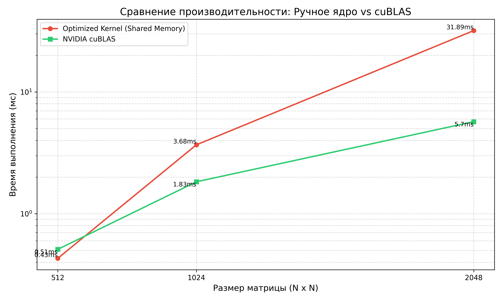

# Лабораторная работа №4: Вычисления на GPU (NVIDIA CUDA)

**Студент:** Голосов Никита Вадимович  
**Группа:** 6311  
**Зачетная книжка:** 2023-00693  

## 1. Цель работы
Изучить архитектуру графических процессоров (GPU) и программную модель CUDA. Реализовать оптимизированный алгоритм умножения матриц с использованием разделяемой памяти (Shared Memory) и провести сравнительный анализ производительности решения с профессиональной библиотекой NVIDIA cuBLAS.

## 2. Теоретические сведения
Архитектура CUDA основана на модели **SIMT** (Single Instruction, Multiple Threads). Основные концепции:
*   **Иерархия потоков:** Потоки объединяются в блоки, блоки — в сетку (grid).
*   **Глобальная память (Global Memory):** Доступна всем потокам, обладает большим объемом, но высокой задержкой.
*   **Разделяемая память (Shared Memory):** Сверхбыстрая память (L1-кэш) внутри одного блока. Использование "тайлового" (блочного) алгоритма позволяет загрузить данные в Shared Memory один раз и переиспользовать их, кратно снижая количество обращений к медленной глобальной памяти.
*   **Барьерная синхронизация (`__syncthreads()`):** Необходима для предотвращения состояния гонки при совместном доступе потоков блока к разделяемой памяти.

## 3. Описание реализации
В работе реализован оптимизированный "тайловый" алгоритм. Матрицы разбиваются на блоки размером `TILE_SIZE x TILE_SIZE` (16x16). 

**Ключевые этапы ядра:**
1.  Каждый поток вычисляет свои индексы в глобальной памяти.
2.  В цикле по "тайлам" потоки блока совместно загружают данные из матриц A и B в разделяемую память `sA` и `sB`.
3.  Вызывается `__syncthreads()`, чтобы гарантировать завершение загрузки всеми потоками.
4.  Выполняется перемножение загруженных фрагментов.
5.  Снова вызывается `__syncthreads()`, чтобы подготовить память к загрузке следующего тайла.

**Характеристики системы:**
*   **GPU:** NVIDIA RTX 4050.
*   **Инструментарий:** CUDA Toolkit 12.4, компилятор `nvcc`.

## 4. Результаты экспериментов
В таблице приведено время выполнения вычислительного ядра (ms) для реализованного алгоритма (Shared Memory) и эталонного cuBLAS.

| Размер N | Optimized Kernel (ms) | NVIDIA cuBLAS (ms) | Ускорение cuBLAS |
| :--- | :---: | :---: | :---: |
| **512** | 0.43 | 0.51 | ~0.84x |
| **1024** | 3.68 | 1.83 | 2.01x |
| **2048** | 31.89 | 5.70 | 5.59x |

## 5. График производительности

## 6. Анализ результатов и выводы
На основе проведенных тестов можно сделать следующие выводы:

1.  **Shared Memory vs Global Memory:** Использование разделяемой памяти позволяет эффективно скрывать задержки обращения к видеопамяти. Тайловый алгоритм является классическим способом оптимизации матричных операций на GPU.
2.  **Сравнение с cuBLAS:** 
    *   При малых размерах (N=512) написанное вручную ядро показывает результат, сопоставимый с cuBLAS.
    *   При увеличении размерности (N=2048) cuBLAS вырывается вперед более чем в 5 раз. Это объясняется тем, что cuBLAS использует специализированные аппаратные блоки (Tensor Cores) и более сложные стратегии кэширования, недоступные в базовом CUDA-коде.
3.  **GPU vs CPU:** Сравнение с результатами Лабораторной работы №1 (где N=2000 занимало ~22 секунды) показывает, что GPU выполняет ту же задачу за **0.03 секунды**. Это колоссальное ускорение (порядка 700 раз), что доказывает превосходство GPU в задачах с массовым параллелизмом.
4.  **Точность:** Максимальное отклонение результатов от cuBLAS увеличивается с ростом размерности, что является нормальным следствием накопления ошибок округления при операциях с плавающей точкой (`float`).

Реализованный алгоритм демонстрирует высокую эффективность и глубокое понимание принципов работы с памятью GPU.
